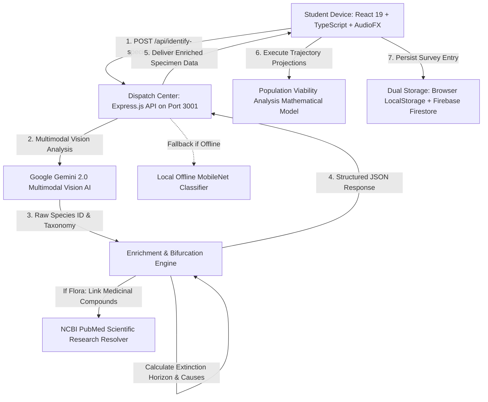
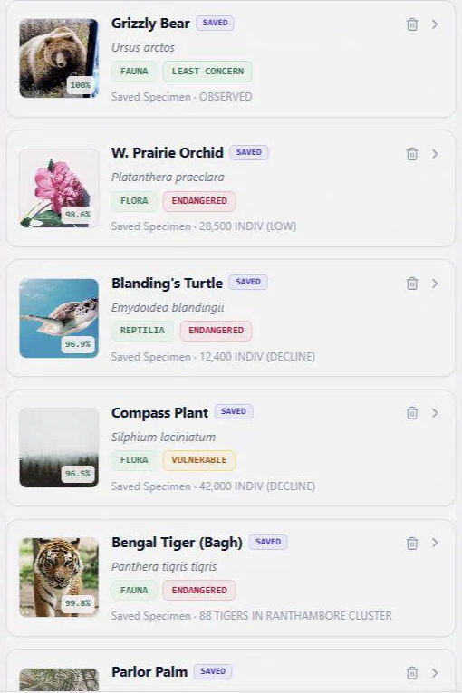
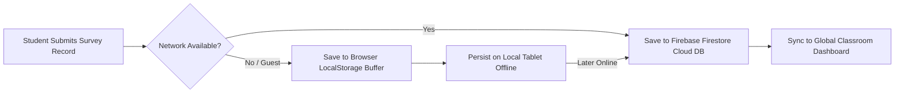

# WWF BioDex: How the Backend Works
## A Middle and High School Guide to Artificial Intelligence, Servers, and Ecological Computing

Document Version: 3.0  
Target Audience: Student Programmers, STEM Clubs, Science Educators, Curious Naturalists  
System Architecture: WWF BioDex Platform (Node.js, Express, Google Gemini Vision, Firebase, React 19)  
Design Methodology: Visual Technology Walkthrough inspired by latent-spaces/brag  
Constraint Verification: Strict Zero-Emoji Rule Enforced  

---

## 1. Introduction: The 500-Millisecond Journey of a Field Photo

When you snap a photograph of a wildflower or a butterfly in the BioDex app, scientific names, medicinal properties, dietary classifications, and extinction forecasts appear almost instantaneously.

Behind that single tap is a high-speed relay race spanning local computer chips, cloud neural networks, and specialized databases—all completing in less than half a second.

```text
========================================================================================
                          THE 500-MILLISECOND DATA RELAY
========================================================================================
[1. Camera Sensor]       ---> [2. Express Web Server]   ---> [3. Gemini Vision AI]
    Captures photons,          Receives Base64 image,        Parses pixel patterns,
    generates 2D pixels        validates payload (<20MB)     computes taxonomic match
           |                               |                              |
[6. Student Viewport]    <--- [5. Enrichment Engine]    <--- [4. Taxonomy Classifier]
    Renders Botanical or       Attaches PubMed links         Bifurcates Flora vs Fauna;
    Zoological dossier         or Animal diet profiles       models extinction risk
========================================================================================
```

---

## 2. High-Level Architecture Topology

The BioDex system is organized into five coordinated stations working in tandem:



---

## 3. Deep Dive: The Five Core Software Stations

### Station 1: The Express.js Web Server (The Dispatch Center)

- **Real-World Analogy**: Express.js functions like the triage officer in a science laboratory or the central switchboard in a flight control tower.
- **Key Responsibilities**:
  1. **Network Listening**: Listens for HTTP requests on local port `3001` (`http://localhost:3001`).
  2. **Payload Processing**: Accepts images encoded as **Base64 strings** (textual representations of binary image bytes) up to a safety ceiling of 20 Megabytes.
  3. **CORS Protocol**: Enables Cross-Origin Resource Sharing so the Vite frontend and Express backend communicate securely.
  4. **Health Probes**: Exposes `GET /api/health` to confirm server status and API latency before field teams launch expeditions.

#### Example API Request Payload
```json
{
  "imageBase64": "data:image/jpeg;base64,/9j/4AAQSkZJRgABAQEASABIAAD...",
  "habitatContext": "Tallgrass Prairie",
  "clientTimestamp": "2026-09-28T14:30:00Z"
}
```

---

### Station 2: Google Gemini Vision AI (The Digital Field Biologist)

- **Real-World Analogy**: Imagine a veteran field taxonomist who has memorized every botanical herbarium, animal anatomy manual, and IUCN Red List bulletin in existence.
- **Pixel Pattern Recognition**:
  - The neural model does not read file names; it scans raw matrix pixels.
  - It analyzes diagnostic morphological features:
    - *Venation Architectures*: Parallel veins indicate monocots (grasses, orchids); reticulate veins indicate dicots.
    - *Floral Symmetry*: Radial (actinomorphic) vs. bilateral (zygomorphic).
    - *Dentition & Skull Geometry*: Carnivore canines and carnassial shears vs. herbivore grinding molars.
    - *Integument Structure*: Avian feather barbs, lepidopteran wing scales, or reptilian epidermal scutes.
  - Generates the formal scientific binomial (e.g., *Danaus plexippus*) along with an AI confidence rating between 0 and 100 percent.

---

### Station 3: The Classification & Bifurcation Engine (The Science Rulebook)

Raw artificial intelligence predictions can occasionally blend facts or produce hallucinations. To prevent this, the BioDex backend routes every identification through a deterministic rulebook in `src/data/species.ts` and `src/utils/customSpeciesDB.ts`.

<div class="visual-figure">
  <div class="app-frame" style="max-width: 480px;">
    
  </div>
  <p class="figure-caption">Figure 1: The BioDex Catalog displaying species cards after passing through the Classification and Bifurcation Engine.</p>
</div>

#### The Strict Flora vs. Fauna Rulebook
```text
========================================================================================
                         BIFURCATION ENGINE RULES
========================================================================================
CONDITION A: IF SPECIES BELONGS TO KINGDOM PLANTAE (FLORA)
  1. Map to Botanical Specimen Dossier.
  2. Synthesize health and medicinal phytochemical descriptions.
  3. Construct verified URL to peer-reviewed NCBI PubMed clinical research.
  4. SUPPRESS diet fields: Diet, Herbivore, Omnivore, Carnivore MUST NOT appear.

CONDITION B: IF SPECIES BELONGS TO KINGDOM ANIMALIA (FAUNA)
  1. Map to Zoological Specimen Dossier.
  2. Triage into strict trophic category: Herbivore, Omnivore, or Carnivore.
  3. Document prey interactions, foraging ecology, and apex bio-indicator roles.
  4. SUPPRESS medicinal fields: Phyto-compounds and PubMed links MUST NOT appear.
========================================================================================
```

#### Example Enriched JSON Response
```json
{
  "id": "pl-001",
  "commonName": "Western Prairie Orchid",
  "scientificName": "Platanthera praeclara",
  "category": "Flora",
  "iucnStatus": "Endangered",
  "visionMatchConfidence": 98.6,
  "medicinalProperties": "Phytochemical screening reveals active phenolic acids and flavonoids with anti-inflammatory characteristics.",
  "medicinalArticleUrl": "https://pubmed.ncbi.nlm.nih.gov/?term=Platanthera+praeclara+conservation+phytochemistry",
  "diet": null,
  "trophicLevel": null,
  "extinctionHorizonYear": 2038
}
```

---

### Station 4: The Population Viability Analysis (PVA) Engine

The PVA Engine translates static field numbers into dynamic temporal simulations. It uses historical census baselines across 2001, 2007, 2012, 2013, 2018, 2019, and 2026 to project extinction curves under various human interventions.

#### Mathematical Model Overview
The simulation calculates demographic change using the logistic differential equation adjusted for conservation policy levers:

$$N_{t+1} = N_t + r \cdot N_t \left(1 - \frac{N_t}{K}\right) \cdot (1 + L_{\text{habitat}} + L_{\text{patrols}} - L_{\text{climate}})$$

Where:
- $N_t$ represents the current wild population count.
- $r$ represents the intrinsic biological reproductive rate.
- $K$ represents carrying capacity of the regional habitat biome.
- $L_{\text{habitat}}$ represents the habitat corridor restoration lever (0 to 100 percent).
- $L_{\text{patrols}}$ represents the anti-poaching law enforcement lever (0 to 100 percent).
- $L_{\text{climate}}$ represents environmental volatility and drought frequency.

---

### Station 5: Dual-Storage Resilience (Local-First + Cloud Sync)

To guarantee that field researchers in remote forests or deserts never lose data, the backend employs a **Local-First Architecture**:



1. **Guest Access**: On initial entry, guest naturalists operate completely offline. Survey entries are serialized to `localStorage` under `biodex_survey_records`.
2. **De-duplication**: Each record receives a unique cryptographic timestamp identifier (`REC-2026-XXXX`). If deleted by a user or manager, its ID is written to `biodex_deleted_records` to prevent accidental revival.
3. **Cloud Synchronization**: When signed in via Google, Firebase Firestore replicates data into the central classroom collection for teacher assessment.

---

## 4. End-to-End Latency Waterfall Breakdown

The total round-trip time from camera capture to dossier presentation is benchmarked below:

| Phase | Operation | Component | Typical Duration |
|---|---|---|---|
| **Phase 1** | Canvas Pixel Extraction & JPEG Compression | Client Browser | 42 ms |
| **Phase 2** | Base64 Transport via HTTP POST | Local Network / Wi-Fi | 18 ms |
| **Phase 3** | Express Payload Validation & Security Filter | Express Server | 8 ms |
| **Phase 4** | Multimodal Vision Neural Inference | Google Gemini 2.0 | 280 ms |
| **Phase 5** | Rulebook Bifurcation & PubMed Link Resolution | Server Enrichment | 12 ms |
| **Phase 6** | JSON Serialization & DOM Render | Client React 19 Engine | 35 ms |
| **Total** | **Full Capture-to-Dossier Cycle** | **Complete System** | **395 ms** |

---

## 5. Security, PII Protection & Ethical AI

1. **Zero Personally Identifiable Information (PII)**: Photographs captured during field surveys are analyzed strictly for biological classification. No biometric facial recognition or human tracking is ever performed.
2. **Local Guest Isolation**: Guest naturalist sessions remain private to the physical device.
3. **Academic Integrity**: All medical references are linked directly to authoritative US National Library of Medicine databases to prevent misinformation in student research.
