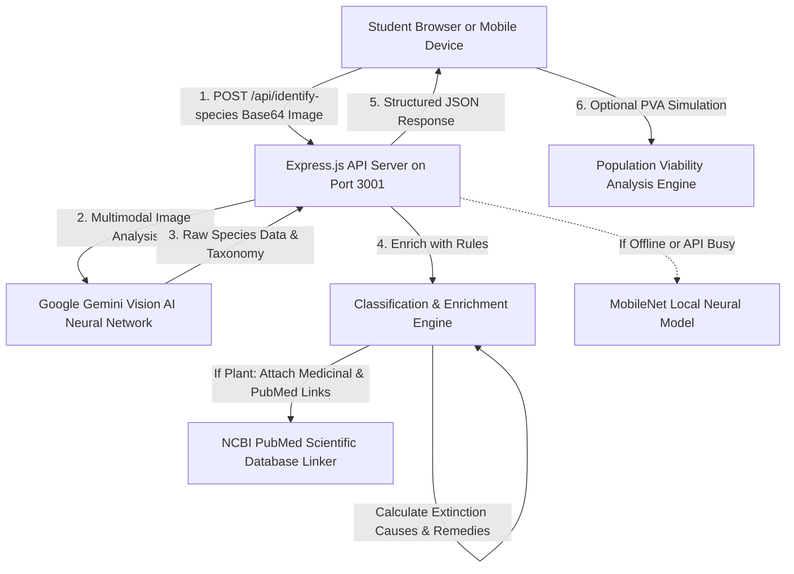
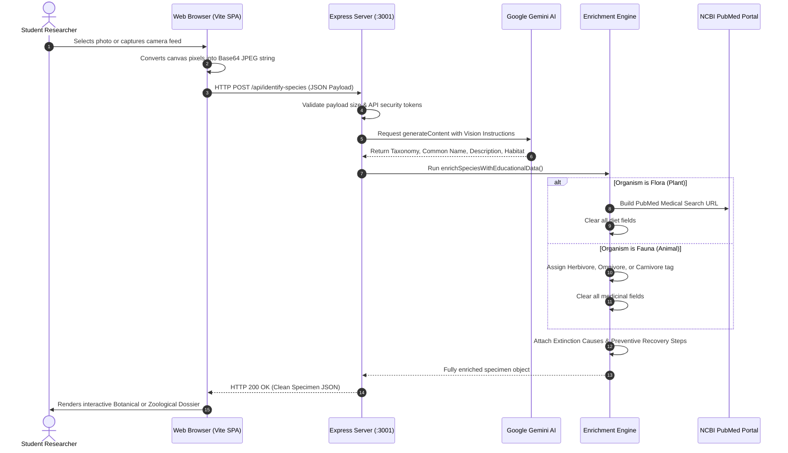

# WWF BioDex: How the Backend Works
## A Middle and High School Guide to Artificial Intelligence, Servers, and Ecological Computing

Document Version: 2.4  
Target Audience: School Students, Coding Clubs, STEM Educators  
System: WWF BioDex Architecture (Node.js, Express, Google Gemini Vision, Vite)  
Constraint Check: No Emojis Used  

---

## 1. Introduction: The 500-Millisecond Journey of a Photo

When you snap a photo of a leaf or an animal on your phone or computer, it looks like instant magic when the screen shows its scientific name, medicinal benefits, animal diet, and extinction risks.

Behind that simple tap is a relay race across multiple computer systems happening in less than half a second.

```
========================================================================================
                               THE 500ms DATA JOURNEY
========================================================================================
[1. Your Camera]  ---> [2. Express Server]  ---> [3. Gemini Vision AI]
  Captures light         Receives image data       Reads image pixels like a human eye
  and creates pixels     and verifies security     and recognizes species markers
        |                       |                            |
[6. Your Screen]  <--- [5. Enrichment Engine] <--- [4. Taxonomy Classifier]
  Displays Botanical     Adds PubMed links for plants   Sorts into Flora vs Fauna
  or Zoological card     or Herbivore/Carnivore diets   and calculates extinction risks
========================================================================================
```

---

## 2. High-Level Architecture Diagram

The WWF BioDex backend acts like a coordinated science laboratory with specialized workstations:



---

## 3. The Four Core Software Stations

Let us break down each part of the backend using analogies from everyday life.

### Station 1: The Express.js Web Server (The Dispatch Center)

- **Everyday Analogy**: Think of Express.js as the front desk receptionist at a science laboratory or the central sorting room at a post office.
- **What it does**:
  1. Listens for incoming internet messages on network address `http://localhost:3001`.
  2. Receives the digital photograph converted into a format called **Base64** (a long string of computer text representing every pixel's color).
  3. Verifies that the image payload is safe and under the maximum limit of 20 Megabytes.
  4. Routes the image to the artificial intelligence brain and waits for the findings.
  5. Formats the final answer into a neat digital parcel called **JSON** (JavaScript Object Notation) and sends it back to your device.

---

### Station 2: Google Gemini Vision AI (The Digital Field Biologist)

- **Everyday Analogy**: Imagine a biologist who has read every botanical textbook, wildlife encyclopedia, and zoology journal ever printed, and has a photographic memory.
- **How it works**:
  - The model does not just look at a file name; it examines the **pixels**.
  - It searches for diagnostic visual features:
    - *Venation patterns* on leaves (parallel vs. netted veins).
    - *Floral symmetry* (radial vs. bilateral).
    - *Dentition and skull shapes* in animals.
    - *Plumage, scale arrangements, and limb proportions*.
  - It calculates the binomial scientific name (such as *Panthera tigris* or *Azadirachta indica*) and its full taxonomic branch:
    - Kingdom -> Phylum -> Class -> Order -> Family -> Genus -> Species.

---

### Station 3: The Classification and Enrichment Engine (The Science Rulebook)

Once the AI returns raw identifications, the system executes a strict set of logical rules written in `src/data/species.ts` and `server.ts`. This engine guarantees that plant facts and animal facts never get mixed up.

#### The Flora Rule (Botanical Specimens)
```text
Condition: Is Kingdom == "Plantae" OR organism is a Tree, Herb, Shrub, or Flower?
Actions:
  1. Enable "Medicinal Properties & Therapeutic Uses" card.
  2. Retrieve verified pharmacological compounds (e.g., salicylic acid, curcuminoids).
  3. Generate a direct hyperlink to the NCBI PubMed scientific database:
     URL = https://pubmed.ncbi.nlm.nih.gov/?term=[Scientific+Name]+medicinal+health
  4. Set dietType = undefined (Hide Diet Card completely).
  5. Set dietDescription = undefined.
  6. Calculate Botanical Extinction Drivers (e.g., habitat clearance, invasive weeds).
  7. Formulate Botanical Preventive Actions (e.g., seed banking, protected plant reserves).
```

#### The Fauna Rule (Zoological Specimens)
```text
Condition: Is Kingdom == "Animalia" OR organism is a Mammal, Bird, Reptile, Fish, or Insect?
Actions:
  1. Enable "Diet & Trophic Classification" card.
  2. Determine Trophic Category based on natural history:
     - "Herbivore": Feeds on primary producers (plants, grasses, fruits).
     - "Omnivore": Feeds on both primary producers and consumers.
     - "Carnivore": Feeds exclusively on secondary or tertiary consumers.
  3. Generate detailed feeding ecology and prey selection notes.
  4. Set medicinalProperties = undefined (Hide Medicinal Card completely).
  5. Set medicinalArticleUrl = undefined (Hide Article Link completely).
  6. Calculate Wildlife Extinction Drivers (e.g., poaching, habitat fragmentation).
  7. Formulate Wildlife Preventive Actions (e.g., anti-poaching patrols, wildlife corridors).
```

---

### Station 4: The Local Offline Fallback Engine (The Emergency Field Manual)

What happens if you are in a remote jungle or your school Wi-Fi goes down?

- The backend includes a lightweight, browser-side neural network powered by **TensorFlow.js (MobileNet)**.
- MobileNet runs directly on your computer's graphics card without needing the cloud.
- If the primary AI is unavailable, the fallback engine scans against a local catalog of 30 curated global species, ensuring you can still complete your field study lesson.

---

## 4. Complete Step-by-Step Data Flow

Here is the exact sequence of events when an image is analyzed:



---

## 5. The PVA Extinction Simulation Engine (`/api/predict-extinction`)

The backend also contains a scientific mathematics tool called a **Population Viability Analysis (PVA)** engine. Scientists use PVA equations to predict whether a wild population will survive over the next 10 to 50 years.

### The Mathematical Formula Used

The server calculates a localized population trajectory using this ecological growth formula:

```text
Localized Growth Rate (Lambda):
  Lambda = Baseline + HabitatBonus - DisturbancePenalty - InvasivePressurePenalty

Projected Population at Year t:
  N(t) = CurrentCount * (Lambda ^ t)
```

### Parameters Examined by the Engine:
1. **Specimen Count**: How many individuals were observed in the survey quadrat.
2. **Habitat Type**: Mangrove, Rainforest, Temperate Grassland, Coral Reef, or Urban Border.
3. **Disturbance Level**: Low, Moderate, or High human interference (roads, trash, noise).
4. **Soil Hydrology**: Waterlogged, Moist Organic, or Compacted Dry Soil.
5. **Invasive Species Pressure**: Presence of non-native aggressive competitor species.

If `Lambda < 1.0`, the population is declining. The server calculates the exact year the population crosses the **Demographic Floor** (the danger threshold of fewer than 5 individuals) and automatically suggests recovery buffers to reverse the trend.

---

## 6. Technology Glossary for Students

Here are the key computing terms used across the WWF BioDex system:

- **API (Application Programming Interface)**: A digital doorway through which two software applications talk to each other.
- **Base64**: A system that takes binary image files (ones and zeros) and turns them into safe text characters so they can travel across the web without getting corrupted.
- **Binomial Nomenclature**: The two-part Latin scientific naming system created by Carl Linnaeus (e.g., *Homo sapiens*, *Panthera leo*).
- **JSON (JavaScript Object Notation)**: A lightweight, human-readable format for storing and transporting structured data across computer networks.
- **Multimodal AI**: An artificial intelligence model that can understand multiple kinds of human data at the same time—such as reading text, hearing audio, and inspecting photographs.
- **PubMed**: The world's largest online index of biomedical and life sciences literature, maintained by the United States National Library of Medicine.
- **Trophic Level**: The position an organism occupies in a food web—such as primary producers (plants), primary consumers (herbivores), and apex predators (carnivores).
- **Vite & Express**: The dual software engine powering BioDex. Express handles network requests and data processing, while Vite builds and updates the user interface on your screen.

---

## 7. How to Test Endpoints on Localhost

Teachers and students learning web programming can test the backend directly using terminal commands or web requests.

### Check Server Health
Open a browser or terminal and request:
```text
GET http://localhost:3001/api/health
```
**Expected Response**:
```json
{
  "status": "ok",
  "time": "2026-09-28T06:23:39.025Z"
}
```

### Run Extinction Risk PVA Calculation
Send a test POST request to the simulation engine:
```text
POST http://localhost:3001/api/predict-extinction
Content-Type: application/json

{
  "speciesName": "Panthera tigris",
  "count": 4,
  "habitatType": "dense_mangrove",
  "disturbanceLevel": "HIGH",
  "soilHydrology": "WATERLOGGED",
  "invasiveThreat": "NONE"
}
```
The server will return the modeled population growth rate, extinction threshold year, and scientific conservation recommendations.
