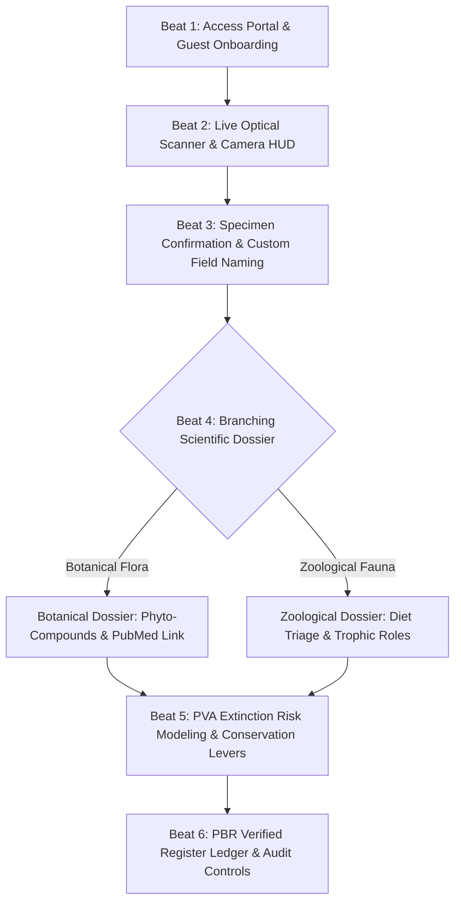
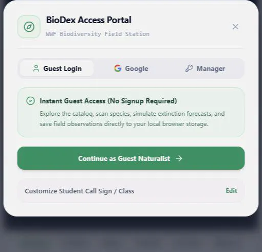
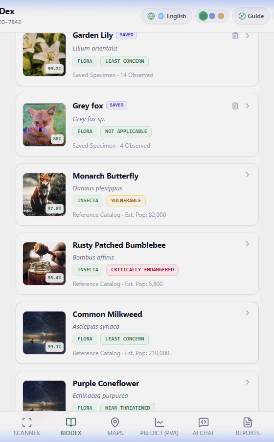

# WWF BioDex: Junior Field Researcher SOP
## Standard Operating Procedure & Interactive Visual Tutorial for Biodiversity Documentation

Document Version: 3.0  
Target Audience: Student Field Naturalists, STEM Educators, Classroom Researchers  
System Architecture: WWF BioDex Field Expedition Platform (Localhost & Web Deployments)  
Design Methodology: Visual Product Walkthrough inspired by latent-spaces/brag  
Constraint Verification: Strict Zero-Emoji Rule Enforced  

---

## 1. Program Mission & Executive Overview

Welcome to the World Wildlife Fund (WWF) BioDex Field Research Program. As a student researcher, your mission is to explore, photograph, analyze, and catalog living organisms in your local ecosystem, whether in schoolyards, botanical gardens, wetlands, or community reserves.

The BioDex system pairs your camera device with dual-engine computer vision (Google Gemini Multimodal Vision and local MobileNet neural fallbacks) to identify species in real time, extract diagnostic ecological facts, evaluate extinction vulnerabilities, and record verified entries into the People's Biodiversity Register (PBR).

---

## 2. Equipment Checklist & Localhost Deployment

Before commencing your field expedition, verify your equipment station:

1. **Hardware**: A tablet, laptop, or mobile workstation equipped with an optical camera sensor.
2. **Web Browser**: A modern standards-compliant browser (Google Chrome, Microsoft Edge, or Mozilla Firefox).
3. **Localhost Server Endpoint**:
   ```text
   http://localhost:3001
   ```
4. **Offline Capability**: Field surveys run entirely offline through browser local storage. Cloud sync with Firebase Firestore activates automatically when an internet uplink is available.

---

## 3. Interactive Walkthrough: The 6-Beat Field Workflow



---

### Beat 1: BioDex Access Portal & Guest Onboarding

When starting the application, the BioDex Access Portal presents three distinct access pathways designed for students, cloud accounts, and classroom managers:

<div class="visual-figure">
  <div class="app-frame" style="max-width: 480px;">
    
  </div>
  <p class="figure-caption">Figure 1: The BioDex Access Portal featuring instant Guest Login, Google Cloud Sync, and Teacher/Manager Access.</p>
</div>

1. **Guest Login (Default & Recommended for Students)**:
   - Click the prominent **Continue as Guest Naturalist** button.
   - Requires no email, password, or cloud account.
   - All catalog entries, scans, and PVA simulation data save directly into the device's local browser memory.
   - Click **Customize Student Call Sign / Class** to personalize your field handle (e.g., `BIO-7842`) and classroom expedition code (e.g., `BIO-EXPEDITION-2026`).
2. **Google Cloud Sync**: Connects student accounts across multiple classroom devices.
3. **Manager Access**: Restricted administrative portal for teachers to review and manage student observation records.

---

### Beat 2: Live Optical Scanner & Camera Viewfinder

Once onboarded, navigate to the **Scanner** tab in the bottom dock.

<div class="mockup-scanner-card">
  <div class="scanner-hud-header">
    <span class="hud-tag">HUD SENSOR: ACTIVE</span>
    <span class="hud-coords">SECTOR 7G | LAT: 41.8781 N | LON: 87.6298 W</span>
    <span class="hud-fps">60 FPS 4K OPTICAL</span>
  </div>
  <div class="scanner-viewfinder">
    <div class="reticle-box">
      <div class="reticle-corner top-left"></div>
      <div class="reticle-corner top-right"></div>
      <div class="reticle-corner bottom-left"></div>
      <div class="reticle-corner bottom-right"></div>
      <div class="reticle-crosshair">+</div>
      <div class="hud-match-chip">MATCH DETECTED: 98.6% CONFIDENCE</div>
    </div>
  </div>
  <div class="scanner-controls-bar">
    <div class="scanner-btn secondary">[FREEZE RETICLE]</div>
    <div class="scanner-btn primary">[CONFIRM SPECIMEN & LOG]</div>
    <div class="scanner-btn secondary">[DOSSIER PREVIEW]</div>
  </div>
</div>

#### Photography Protocol for Accurate AI Identification
- **Framing**: Center the organism so it fills at least 50 percent of the targeting viewfinder.
- **Lighting**: Photograph with natural morning or afternoon sunlight. Avoid shooting directly into backlit sun glare.
- **Diagnostic Botanical Features**: Capture leaf margins, vein patterns, floral symmetry, and stem arrangements.
- **Diagnostic Zoological Features**: Capture facial profiles, limb structure, plumage patterns, or scale textures.

---

### Beat 3: Species Catalog & Saved Discoveries

Every confirmed specimen is immediately registered into the BioDex Species Catalog and cross-referenced with regional wildlife census databases.

<div class="visual-figure">
  <div class="app-frame" style="max-width: 480px;">
    
  </div>
  <p class="figure-caption">Figure 2: Species Catalog displaying user-saved specimens (Grizzly Bear, Prairie Orchid, Blanding's Turtle, Bengal Tiger) with SAVED badges, confidence scores, and individual deletion controls.</p>
</div>

#### Catalog Management Features
1. **Saved Badges**: Observations confirmed in the field are tagged with an indigo **SAVED** indicator and prioritized at the top of your catalog.
2. **Direct Specimen Removal**: Click the trash can icon beside any user-saved specimen to delete it from both the local catalog and the PBR field register.
3. **Filter Pills**: Switch between **All**, **My Saved**, **Flora**, **Fauna**, and **Avian** to focus on specific taxonomic classes.
4. **Real-time Search**: Search by common name (e.g., "Orchid"), scientific name (e.g., *Platanthera*), or habitat biome.

<div class="visual-figure">
  <div class="app-frame" style="max-width: 520px;">
    
  </div>
  <p class="figure-caption">Figure 3: Catalog reference cards featuring verified diagnostic photography for the Monarch Butterfly (Danaus plexippus) and Rusty Patched Bumblebee (Bombus affinis).</p>
</div>

---

### Beat 4: Branching Scientific Dossiers (Flora vs. Fauna Segregation)

To maintain strict scientific integrity, the BioDex platform splits its dossier engine into two mutually exclusive tracks:

```text
========================================================================================
                         BRANCHING SPECIMEN DOSSIER LOGIC
========================================================================================
       BOTANICAL SPECIMEN (FLORA)                   ZOOLOGICAL SPECIMEN (FAUNA)
-----------------------------------------   --------------------------------------------
[X] Kingdom Plantae / Botanical Biology     [X] Kingdom Animalia / Zoological Biology
[X] Health & Medicinal Phytochemistry       [X] Dietary Triage: Herbivore/Omnivore/Carnivore
[X] Peer-Reviewed PubMed Article Link       [X] Trophic Feeding Role & Prey Relationships
[X] Habitat Fragmentation & Climate Zone    [X] Poaching & Human Conflict Drivers
[X] Seed Preservation & Corridor Actions    [X] Wildlife Corridors & Anti-Poaching Patrols
[!] Diet Classification is NOT displayed     [!] Medicinal links are NOT displayed
========================================================================================
```

#### Track A: Botanical Specimen Dossier (Plants, Wildflowers, Trees, Fungi)
When scanning botanical specimens such as the Western Prairie Orchid (*Platanthera praeclara*) or Purple Coneflower (*Echinacea purpurea*):
1. **Phytochemical & Medicinal Evaluation**:
   - Details clinically documented chemical constituents (e.g., caffeic acids, flavonoids, volatile terpenes).
   - Explains historical applications by indigenous peoples and modern pharmacological relevance.
2. **NCBI PubMed Research Article Link**:
   - Every botanical dossier includes a dedicated link button: **Read Article / Scientific Research**.
   - Clicking this opens an authentic scientific publication indexed in the United States National Library of Medicine (NCBI PubMed).
   - Students can cite these papers directly in classroom biology reports.
3. **Exclusion Rule**: Plants synthesize their own food via photosynthesis; therefore, animal diet categories (Herbivore, Carnivore, Omnivore) are strictly omitted.

#### Track B: Zoological Specimen Dossier (Mammals, Birds, Reptiles, Insects, Fish)
When scanning zoological specimens such as the Bengal Tiger (*Panthera tigris*) or Monarch Butterfly (*Danaus plexippus*):
1. **Diet Triage & Trophic Classification**:
   - **Herbivore**: Eats exclusively flora, leaves, nectar, or roots (e.g., Monarch Butterfly caterpillar feeding on milkweed).
   - **Omnivore**: Consumes both vegetation and animal matter (e.g., Sloth Bear, Grey Fox).
   - **Carnivore**: Hunts other animals and maintains ecosystem equilibrium (e.g., Bengal Tiger preying on chital deer).
2. **Ecosystem Role & Feeding Ecology**:
   - Documents prey preferences, foraging radius, and apex regulator functions.
3. **Exclusion Rule**: Animals do not possess herbal medicinal properties; therefore, medicinal compound descriptions and PubMed herbal links are strictly omitted.

---

### Beat 5: Population Viability Analysis (PVA Simulation)

The BioDex PVA Simulator is a mathematical forecasting module that projects species population trends over a 20-year demographic horizon (2001 to 2031 and beyond to 2050).

<div class="mockup-pva-card">
  <div class="pva-header">
    <span class="pva-title">POPULATION VIABILITY ANALYSIS (PVA) ENGINE</span>
    <span class="pva-status badge-alert">BASELINE: UNMITIGATED COLLAPSE BY YEAR 2038</span>
  </div>
  <div class="pva-levers-container">
    <div class="lever-row">
      <span class="lever-name">Habitat Protection & Corridor Reforestation</span>
      <div class="lever-bar-track"><div class="lever-bar-fill" style="width: 70%;"></div></div>
      <span class="lever-val">+70%</span>
    </div>
    <div class="lever-row">
      <span class="lever-name">Anti-Poaching Patrols & Law Enforcement</span>
      <div class="lever-bar-track"><div class="lever-bar-fill" style="width: 85%;"></div></div>
      <span class="lever-val">+85%</span>
    </div>
    <div class="lever-row">
      <span class="lever-name">Climate Volatility Resilience & Hydrology</span>
      <div class="lever-bar-track"><div class="lever-bar-fill" style="width: 60%;"></div></div>
      <span class="lever-val">+60%</span>
    </div>
  </div>
  <div class="pva-forecast-summary">
    <div class="forecast-box">
      <span class="forecast-label">Current Census (2026)</span>
      <span class="forecast-num">28,500</span>
    </div>
    <div class="forecast-box">
      <span class="forecast-label">Unmitigated Horizon</span>
      <span class="forecast-num alert">Year 2038</span>
    </div>
    <div class="forecast-box">
      <span class="forecast-label">Mitigated Rebound Goal</span>
      <span class="forecast-num success">45,000</span>
    </div>
  </div>
</div>

#### Student Simulation Steps
1. Navigate to the **Predict (PVA)** tab.
2. Select your specimen from the survey history dropdown.
3. Review the 20-Year Baseline Census table (2001, 2007, 2013, 2018, 2019, 2026).
4. Adjust the three conservation levers to test management hypotheses:
   - How does a 50 percent increase in anti-poaching patrol intensity push back the extinction horizon?
   - What happens to reproductive recruitment when habitat fragmentation is reduced?
5. Observe the calculated rebound trajectory curve updating dynamically.

---

### Beat 6: People's Biodiversity Register (PBR) & Audit Log

The final phase of field observation is cataloging your survey into the permanent scientific ledger:

1. **People's Biodiversity Register (PBR)**:
   - Located under the third segment tab of BioDex: **My Observations (PBR)**.
   - Stores the unique observation identifier (`REC-2026-XXXX`), GPS sector coordinates, census count, and observation timestamp.
2. **Audit & Deletion Controls**:
   - Students and teachers can remove test or redundant observations by clicking the delete icon.
   - Deleting a survey record automatically clears it from the local browser database and advances the active report inspector to the next record.
3. **Smart Report Export**:
   - Navigate to the **Reports** tab to inspect comprehensive field summaries formatted according to national biodiversity registry standards.

---

## 4. Student Field Naturalist Honor Code

1. **Do No Harm**: Observe living creatures in their natural state without disturbing nests, crushing root systems, or harassing wildlife.
2. **Scientific Precision**: Always verify diagnostic traits before submitting a classification.
3. **Data Integrity**: Never invent census counts or falsify GPS coordinates. True science depends on honest, reproducible field data.
