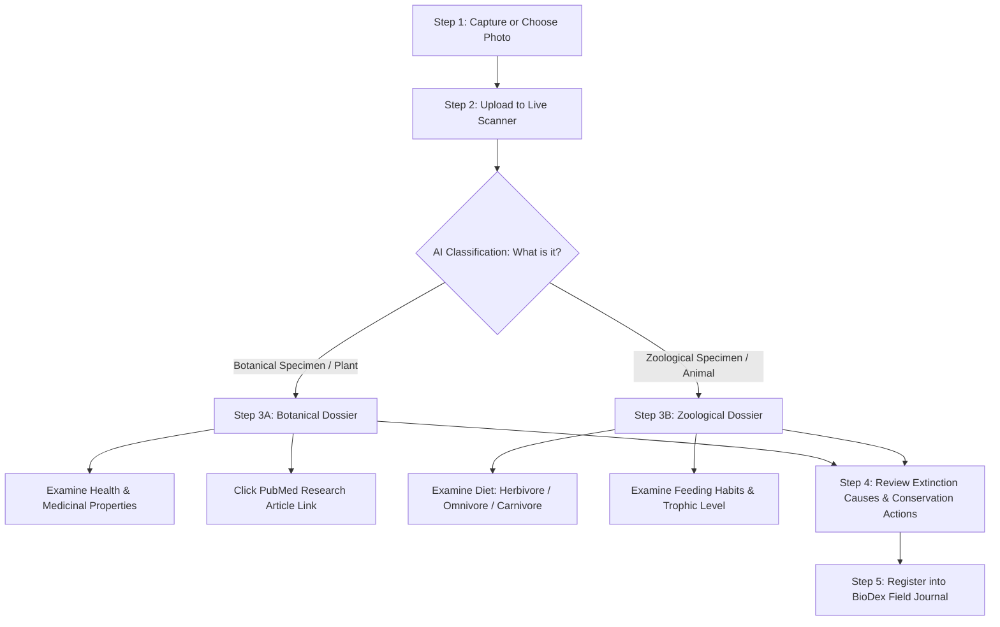

# WWF BioDex: Junior Field Researcher SOP
## Standard Operating Procedure for Biodiversity Documentation & Specimen Analysis

Document Version: 2.4  
Target Audience: Student Researchers, Science Teachers, Classroom Naturalists  
System: WWF BioDex (Localhost & Web Deployments)  
Constraint Check: No Emojis Used  

---

## 1. Mission Overview

Welcome to the WWF BioDex field research program. As a student researcher, your goal is to observe, photograph, and catalog biological specimens in your local schoolyard, community garden, park, or forest. 

The BioDex system pairs your camera with advanced artificial intelligence and scientific databases to identify living organisms, examine their ecological roles, study medical uses of plants, determine animal feeding habits, and identify conservation actions needed to protect endangered species.

---

## 2. Equipment & Localhost Setup

Before beginning your field survey, confirm your equipment is ready:

1. **Hardware**: A laptop, tablet, or smartphone equipped with a camera.
2. **Software**: A modern web browser (Google Chrome, Mozilla Firefox, or Microsoft Edge).
3. **Localhost Address**: Open your browser and navigate to:
   ```text
   http://localhost:3001
   ```
4. **Active Connection**: Ensure the WWF BioDex server displays the main dashboard with the Live Scanner, Species Catalog, and BioDex Field Journal.

---

## 3. Standard 5-Step Research Workflow



---

### Step 1: Capturing the Specimen

High-quality observations lead to accurate scientific identifications. Follow these three photography rules:

- **Framing**: Place the primary subject in the center of the viewfinder. Fill at least 50 percent of the frame with the organism.
- **Lighting**: Avoid heavy backlighting. Direct morning or afternoon natural sunlight produces the clearest diagnostic features.
- **Diagnostic Details**:
  - For Plants: Capture leaves, flowers, bark, or seed pods.
  - For Animals: Capture the head, body profile, limbs, fur patterns, or scale textures.

---

### Step 2: Uploading to the Live Scanner

1. On the BioDex navigation menu, select **Scanner**.
2. Choose one of two capture methods:
   - **Live Camera**: Click *Open Camera*, line up the subject in the targeting reticle, and click *Capture Specimen*.
   - **Image Upload**: Click *Upload Photo* to select an existing photograph from your device.
3. The system processes the image through the neural network and returns a preliminary match with confidence ratings and taxonomic names.
4. Click **View Full Dossier** to inspect the comprehensive scientific report.

---

### Step 3: Branching Scientific Dossiers (Flora vs. Fauna)

The WWF BioDex strictly separates plant biology from animal biology to ensure scientific accuracy.

```
=================================================================
                 SPECIMEN DOSSIER BRANCHING LOGIC
=================================================================
   IF SPECIMEN = FLORA (PLANT)         IF SPECIMEN = FAUNA (ANIMAL)
----------------------------------  -----------------------------
 [Botanical Specimen Dossier]        [Zoological Specimen Dossier]
 - Plant Taxonomy & Climate Zone     - Animal Taxonomy & Habitat
 - Health & Medicinal Properties     - Diet: Herbivore/Omnivore/Carnivore
 - Peer-Reviewed PubMed Link         - Feeding Behavior & Prey
 - Extinction Threat Drivers         - Extinction Threat Drivers
 - Preventive Recovery Measures      - Preventive Recovery Measures
 - [Diet is NOT shown]               - [Medicinal link is NOT shown]
=================================================================
```

#### Path A: When You Scan Flora (Plants, Trees, Herbs, Fungi)

When a plant is identified, the dossier switches to the **Botanical Specimen Dossier**:

1. **Taxonomic Hierarchy**: Review Kingdom (*Plantae*), Family, Genus, and Scientific Name.
2. **Health and Medicinal Properties**:
   - Reads historical and modern therapeutic uses (e.g., anti-inflammatory, antimicrobial, or antioxidant bio-compounds).
   - Explains how indigenous communities and modern pharmacology utilize the plant's phytochemicals.
3. **Scholarly Article Link (NCBI PubMed)**:
   - Click the interactive button labeled **Read Article / Scientific Research**.
   - This opens an authentic, peer-reviewed medical and biological research paper directly from the National Center for Biotechnology Information (NCBI PubMed) in a new browser tab.
   - Use this article to answer classroom research questions about laboratory-tested medical applications.
4. **Dietary Status Note**: Plants do not have animal diets; therefore, the diet classification card is completely hidden.

#### Path B: When You Scan Fauna (Mammals, Birds, Reptiles, Insects, Fish)

When an animal is identified, the dossier switches to the **Zoological Specimen Dossier**:

1. **Diet Classification Badge**:
   - The organism is sorted into one of three strict trophic categories:
     - **Herbivore**: Eats exclusively vegetation, fruits, roots, or seeds (e.g., Asian Elephant, Black Rhinoceros).
     - **Omnivore**: Consumes both plant matter and other animals (e.g., Sloth Bear, Red Fox).
     - **Carnivore**: Hunts and preys exclusively on other animals (e.g., Bengal Tiger, Snow Leopard).
2. **Feeding Behavior & Trophic Role**:
   - Explains foraging strategies, prey selection, and energy transfer within the food web.
3. **Medical Status Note**: Animals are not medical flora; therefore, plant medicinal properties and PubMed herbal article links are completely hidden.

---

### Step 4: Analyzing Extinction Risks and Preventive Measures

Every organism, whether plant or animal, faces human and environmental pressures. Both dossiers display two dedicated conservation panels:

1. **Extinction Risks and Primary Causes**:
   - Pinpoints the root drivers threatening the species (e.g., deforestation, climate change, agricultural runoff, illegal poaching, or invasive species competition).
   - Reviews the IUCN Red List status (Least Concern, Vulnerable, Endangered, or Critically Endangered).
2. **Preventive Measures and Conservation Actions**:
   - Outlines actionable human interventions to reverse population decline.
   - Examples: Establishing protected corridors, enforcing anti-poaching satellite monitoring, habitat buffer zones, and community-led seed banks.

---

### Step 5: Recording into the BioDex Field Journal

1. After reviewing the dossier, close the modal or click **Register Specimen**.
2. Complete the field observation form:
   - Verify the location coordinates or site name (e.g., "School Science Garden - Sector B").
   - Select the habitat condition (Pristine, Moderate Disturbance, or Degraded).
   - Add your field notes and observations.
3. Click **Save to BioDex**.
4. The specimen is permanently recorded in your student profile and will now appear on the interactive **Habitat Map** and in your **BioDex Catalog**.

---

## 4. Student Dossier Comparison Matrix

| Feature / Field | Botanical Dossier (Flora) | Zoological Dossier (Fauna) | Purpose for Student Researchers |
| :--- | :--- | :--- | :--- |
| **Dossier Header** | Botanical Specimen Dossier | Zoological Specimen Dossier | Confirms the biological kingdom of the specimen. |
| **Scientific Name** | Binomial (e.g., *Aloe vera*) | Binomial (e.g., *Panthera tigris*) | Standard global scientific nomenclature. |
| **Diet Classification** | Not Applicable (Hidden) | Herbivore, Omnivore, or Carnivore | Teaches trophic levels and food chains. |
| **Dietary Description** | Not Applicable (Hidden) | Detailed feeding behavior | Explains energy flow in ecosystems. |
| **Medicinal Properties** | Active phytochemicals & therapeutic uses | Not Applicable (Hidden) | Connects botany to human health and pharmacology. |
| **Scholarly Article Link**| PubMed research paper link | Not Applicable (Hidden) | Direct portal to real scientific literature. |
| **Extinction Causes** | Specific plant threat drivers | Specific animal threat drivers | Explains ecological vulnerabilities. |
| **Preventive Measures** | Targeted botanical conservation | Targeted wildlife conservation | Teaches practical environmental stewardship. |

---

## 5. Classroom Field Exercises

Here are three suggested activities for students using the BioDex:

1. **The Ecosystem Food Web Challenge**:
   - Scan 2 Herbivores, 1 Carnivore, and 2 Plants in your survey area.
   - Draw a diagram linking them together in a food chain based on their diet descriptions.

2. **The Ethnobotany Investigation**:
   - Scan 3 different local plants or trees.
   - Click the PubMed research article link for each one.
   - Note down one active chemical compound discovered in each plant and its medical use.

3. **The Conservation Action Plan**:
   - Find an organism classified as Vulnerable, Endangered, or Critically Endangered.
   - Read the Extinction Reasons and Preventive Measures sections.
   - Write a two-paragraph action plan explaining what your school community can do to protect this species' habitat.

---

## 6. Troubleshooting Common Issues

- **Question**: The scanner says "Specimen Unidentified or Low Confidence."
  - **Remedy**: Move closer to the subject, steady your hands, ensure there is ample light, and retake the photo without motion blur.
- **Question**: Why does my pet dog scan show no medicinal article?
  - **Answer**: The system accurately identifies dogs as Fauna (*Canis lupus familiaris*). As an animal, it receives a Diet classification (Carnivore/Omnivore), while medicinal articles are reserved strictly for Flora.
- **Question**: Can I test the application without outdoor access?
  - **Answer**: Yes. You can upload reference photographs from reputable educational archives (e.g., WWF, National Geographic, or Wikipedia) to test the scanner from your classroom desk.
